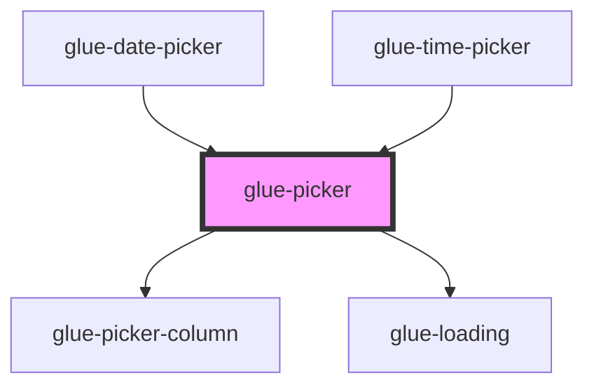

# glue-picker

<!-- Auto Generated Below -->

## Properties

| Property            | Attribute             | Description | Type      | Default      |
| ------------------- | --------------------- | ----------- | --------- | ------------ |
| `allowHtml`         | `allow-html`          |             | `boolean` | `undefined`  |
| `cancelButtonText`  | `cancel-button-text`  |             | `string`  | `undefined`  |
| `childrenKey`       | `children-key`        |             | `string`  | `'children'` |
| `columns`           | --                    |             | `any[]`   | `[]`         |
| `confirmButtonText` | `confirm-button-text` |             | `string`  | `undefined`  |
| `defaultIndex`      | `default-index`       |             | `number`  | `0`          |
| `first`             | `first`               |             | `string`  | `undefined`  |
| `g_title`           | `g_title`             |             | `string`  | `undefined`  |
| `itemHeight`        | `item-height`         |             | `number`  | `44`         |
| `loading`           | `loading`             |             | `boolean` | `undefined`  |
| `readonly`          | `readonly`            |             | `boolean` | `undefined`  |
| `showToolbar`       | `show-toolbar`        |             | `boolean` | `false`      |
| `swipeDuration`     | `swipe-duration`      |             | `number`  | `1000`       |
| `textKey`           | `text-key`            |             | `string`  | `'text'`     |
| `toolbarPosition`   | `toolbar-position`    |             | `string`  | `'top'`      |
| `valuesKey`         | `values-key`          |             | `string`  | `'values'`   |
| `visibleItemCount`  | `visible-item-count`  |             | `number`  | `6`          |

## Events

| Event         | Description | Type               |
| ------------- | ----------- | ------------------ |
| `glueCancel`  |             | `CustomEvent<any>` |
| `glueChange`  |             | `CustomEvent<any>` |
| `glueConfirm` |             | `CustomEvent<any>` |

## Methods

### `confirm() => Promise<void>`

#### Returns

Type: `Promise<void>`

### `getColumnIndex(index: any) => Promise<any>`

#### Returns

Type: `Promise<any>`

### `getColumnValue(index: any) => Promise<any>`

#### Returns

Type: `Promise<any>`

### `getColumnValues(index: any) => Promise<any>`

#### Returns

Type: `Promise<any>`

### `getIndexes() => Promise<void>`

#### Returns

Type: `Promise<void>`

### `getValues() => Promise<any[]>`

#### Returns

Type: `Promise<any[]>`

### `setColumnIndex(columnIndex: any, optionIndex: any) => Promise<void>`

#### Returns

Type: `Promise<void>`

### `setColumnValue(index: any, value: any) => Promise<void>`

#### Returns

Type: `Promise<void>`

### `setColumnValues(index: any, options: any) => Promise<void>`

#### Returns

Type: `Promise<void>`

### `setIndexes(indexes: any) => Promise<void>`

#### Returns

Type: `Promise<void>`

### `setValues(values: any) => Promise<void>`

#### Returns

Type: `Promise<void>`

## Dependencies

### Used by

 - [glue-date-picker](../glue-date-picker)
 - [glue-time-picker](../glue-time-picker)

### Depends on

- [glue-picker-column](../glue-picker-column)
- [glue-loading](../glue-loading)

### Graph

----------------------------------------------

*Built with [StencilJS](https://stenciljs.com/)*
