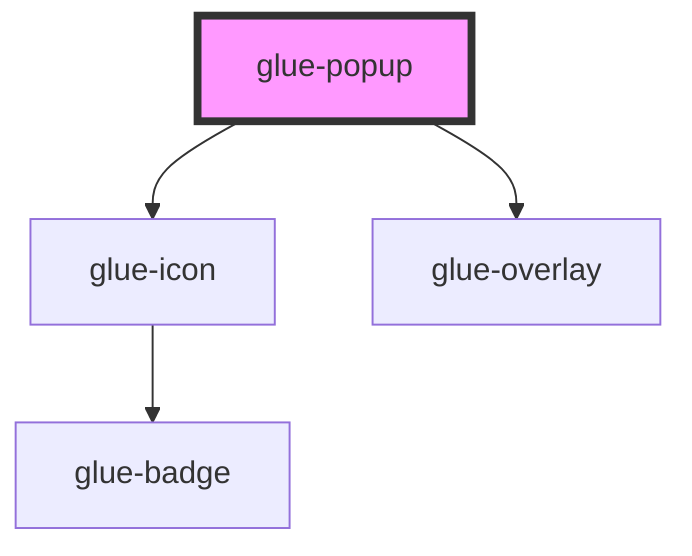

# glue-popup

<!-- Auto Generated Below -->

## Properties

| Property              | Attribute                | Description | Type               | Default       |
| --------------------- | ------------------------ | ----------- | ------------------ | ------------- |
| `closeIcon`           | `close-icon`             |             | `string`           | `'cross'`     |
| `closeIconPosition`   | `close-icon-position`    |             | `string`           | `'top-right'` |
| `closeOnClickOverlay` | `close-on-click-overlay` |             | `boolean`          | `true`        |
| `closeOnPopstate`     | `close-on-popstate`      |             | `boolean`          | `undefined`   |
| `closeable`           | `closeable`              |             | `boolean`          | `undefined`   |
| `duration`            | `duration`               |             | `string`           | `undefined`   |
| `height`              | `height`                 |             | `string`           | `undefined`   |
| `lazyRender`          | `lazy-render`            |             | `boolean`          | `true`        |
| `lockScroll`          | `lock-scroll`            |             | `boolean`          | `true`        |
| `overlay`             | `overlay`                |             | `boolean`          | `true`        |
| `overlayClass`        | `overlay-class`          |             | `any`              | `null`        |
| `overlayStyle`        | --                       |             | `object`           | `undefined`   |
| `position`            | `position`               |             | `string`           | `'center'`    |
| `round`               | `round`                  |             | `boolean`          | `true`        |
| `safeAreaInsetBottom` | `safe-area-inset-bottom` |             | `boolean`          | `false`       |
| `show`                | `show`                   |             | `boolean`          | `undefined`   |
| `teleport`            | `teleport`               |             | `object \| string` | `undefined`   |
| `transition`          | `transition`             |             | `string`           | `undefined`   |
| `transitionAppear`    | `transition-appear`      |             | `boolean`          | `undefined`   |
| `width`               | `width`                  |             | `string`           | `undefined`   |
| `zIndex`              | `z-index`                |             | `string`           | `'2000'`      |

## Events

| Event            | Description | Type               |
| ---------------- | ----------- | ------------------ |
| `clickCloseIcon` |             | `CustomEvent<any>` |
| `close`          |             | `CustomEvent<any>` |
| `onClick`        |             | `CustomEvent<any>` |
| `onClickOverlay` |             | `CustomEvent<any>` |
| `onClosed`       |             | `CustomEvent<any>` |
| `onOpened`       |             | `CustomEvent<any>` |
| `open`           |             | `CustomEvent<any>` |

## Dependencies

### Depends on

- [glue-icon](../glue-icon)
- [glue-overlay](../glue-overlay)

### Graph

----------------------------------------------

*Built with [StencilJS](https://stenciljs.com/)*
