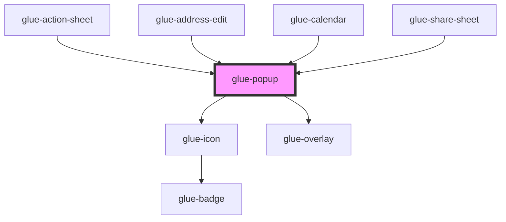

# glue-popup

<!-- Auto Generated Below -->

## Properties

| Property              | Attribute                | Description | Type                    | Default       |
| --------------------- | ------------------------ | ----------- | ----------------------- | ------------- |
| `closeIcon`           | `close-icon`             |             | `string`                | `'cross'`     |
| `closeIconPosition`   | `close-icon-position`    |             | `string`                | `'top-right'` |
| `closeOnClickOverlay` | `close-on-click-overlay` |             | `boolean`               | `false`       |
| `closeOnPopstate`     | `close-on-popstate`      |             | `boolean`               | `undefined`   |
| `closeable`           | `closeable`              |             | `boolean`               | `undefined`   |
| `content`             | `content`                |             | `string`                | `''`          |
| `duration`            | `duration`               |             | `number \| string`      | `DURATION`    |
| `easing`              | `easing`                 |             | `string`                | `EASING`      |
| `height`              | `height`                 |             | `string`                | `undefined`   |
| `lazyRender`          | `lazy-render`            |             | `boolean`               | `false`       |
| `lockScroll`          | `lock-scroll`            |             | `boolean`               | `false`       |
| `overlay`             | `overlay`                |             | `boolean`               | `false`       |
| `overlayClass`        | `overlay-class`          |             | `any`                   | `null`        |
| `overlayStyle`        | --                       |             | `object`                | `undefined`   |
| `position`            | `position`               |             | `string`                | `'center'`    |
| `round`               | `round`                  |             | `boolean`               | `false`       |
| `safeAreaInsetBottom` | `safe-area-inset-bottom` |             | `boolean`               | `false`       |
| `show`                | `show`                   |             | `boolean`               | `undefined`   |
| `teleport`            | `teleport`               |             | `HTMLElement \| string` | `'body'`      |
| `transitionAppear`    | `transition-appear`      |             | `boolean`               | `undefined`   |
| `width`               | `width`                  |             | `string`                | `undefined`   |
| `zIndex`              | `z-index`                |             | `string`                | `'2000'`      |

## Events

| Event                | Description | Type               |
| -------------------- | ----------- | ------------------ |
| `glueClick`          |             | `CustomEvent<any>` |
| `glueClickCloseIcon` |             | `CustomEvent<any>` |
| `glueClickOverlay`   |             | `CustomEvent<any>` |
| `glueClose`          |             | `CustomEvent<any>` |
| `glueClosed`         |             | `CustomEvent<any>` |
| `glueOpen`           |             | `CustomEvent<any>` |
| `glueOpened`         |             | `CustomEvent<any>` |

## Dependencies

### Used by

- [glue-action-sheet](../glue-action-sheet)
- [glue-address-edit](../glue-address-edit)
- [glue-calendar](../glue-calendar)
- [glue-share-sheet](../glue-share-sheet)

### Depends on

- [glue-icon](../glue-icon)
- [glue-overlay](../glue-overlay)

### Graph

---

_Built with [StencilJS](https://stenciljs.com/)_
