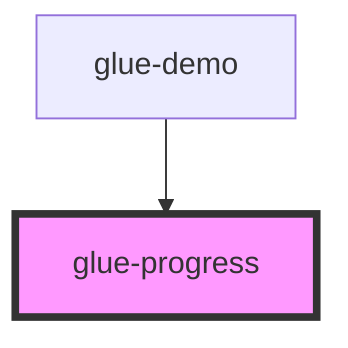

# glue-progress

<!-- Auto Generated Below -->

## Properties

| Property      | Attribute      | Description | Type      | Default     |
| ------------- | -------------- | ----------- | --------- | ----------- |
| `color`       | `color`        |             | `string`  | `undefined` |
| `inactive`    | `inactive`     |             | `boolean` | `undefined` |
| `percentage`  | `percentage`   |             | `number`  | `undefined` |
| `pivotColor`  | `pivot-color`  |             | `string`  | `undefined` |
| `pivotText`   | `pivot-text`   |             | `string`  | `undefined` |
| `showPivot`   | `show-pivot`   |             | `boolean` | `false`     |
| `strokeWidth` | `stroke-width` |             | `number`  | `undefined` |
| `textColor`   | `text-color`   |             | `string`  | `undefined` |
| `trackColor`  | `track-color`  |             | `string`  | `undefined` |

## Dependencies

### Used by

 - [glue-demo](../glue-demo)

### Graph

----------------------------------------------

*Built with [StencilJS](https://stenciljs.com/)*
