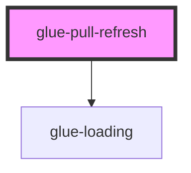

# glue-pull-refresh

<!-- Auto Generated Below -->

## Properties

| Property            | Attribute            | Description | Type      | Default               |
| ------------------- | -------------------- | ----------- | --------- | --------------------- |
| `animationDuration` | `animation-duration` |             | `number`  | `300`                 |
| `disabled`          | `disabled`           |             | `boolean` | `undefined`           |
| `headHeight`        | `head-height`        |             | `number`  | `DEFAULT_HEAD_HEIGHT` |
| `loadingText`       | `loading-text`       |             | `string`  | `undefined`           |
| `loosingText`       | `loosing-text`       |             | `string`  | `undefined`           |
| `modelValue`        | `model-value`        |             | `boolean` | `false`               |
| `pullingText`       | `pulling-text`       |             | `string`  | `undefined`           |
| `successDuration`   | `success-duration`   |             | `number`  | `500`                 |
| `successText`       | `success-text`       |             | `string`  | `undefined`           |

## Events

| Event     | Description | Type               |
| --------- | ----------- | ------------------ |
| `refresh` |             | `CustomEvent<any>` |

## Dependencies

### Depends on

- [glue-loading](../glue-loading)

### Graph

---

_Built with [StencilJS](https://stenciljs.com/)_
