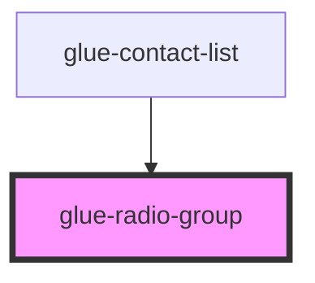

# glue-radio-group

<!-- Auto Generated Below -->

## Properties

| Property       | Attribute       | Description | Type               | Default     |
| -------------- | --------------- | ----------- | ------------------ | ----------- |
| `checkedColor` | `checked-color` |             | `string`           | `undefined` |
| `direction`    | `direction`     |             | `string`           | `undefined` |
| `disabled`     | `disabled`      |             | `boolean`          | `undefined` |
| `iconSize`     | `icon-size`     |             | `number \| string` | `undefined` |
| `modelValue`   | `model-value`   |             | `any`              | `null`      |

## Dependencies

### Used by

 - [glue-contact-list](../glue-contact-list)

### Graph

----------------------------------------------

*Built with [StencilJS](https://stenciljs.com/)*
