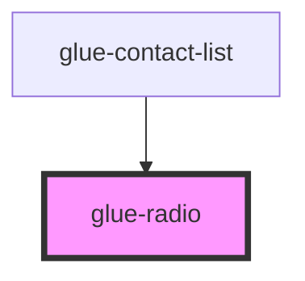

# glue-radio

<!-- Auto Generated Below -->

## Properties

| Property        | Attribute        | Description | Type               | Default     |
| --------------- | ---------------- | ----------- | ------------------ | ----------- |
| `checkedColor`  | `checked-color`  |             | `string`           | `undefined` |
| `disabled`      | `disabled`       |             | `boolean`          | `undefined` |
| `iconSize`      | `icon-size`      |             | `number \| string` | `undefined` |
| `labelDisabled` | `label-disabled` |             | `boolean`          | `undefined` |
| `labelPosition` | `label-position` |             | `string`           | `undefined` |
| `modelValue`    | --               |             | `null`             | `undefined` |
| `name`          | --               |             | `null`             | `undefined` |
| `shape`         | `shape`          |             | `string`           | `'round'`   |

## Dependencies

### Used by

 - [glue-contact-list](../glue-contact-list)

### Graph

----------------------------------------------

*Built with [StencilJS](https://stenciljs.com/)*
