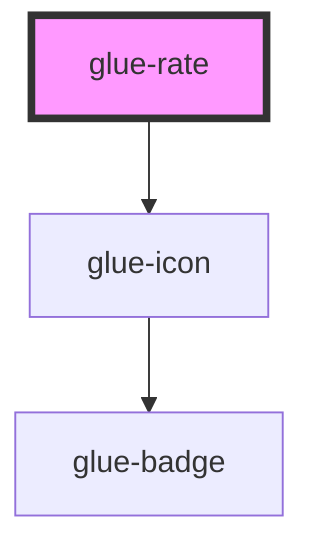

# glue-rate

<!-- Auto Generated Below -->

## Properties

| Property        | Attribute        | Description | Type      | Default     |
| --------------- | ---------------- | ----------- | --------- | ----------- |
| `allowHalf`     | `allow-half`     |             | `boolean` | `undefined` |
| `color`         | `color`          |             | `string`  | `undefined` |
| `count`         | `count`          |             | `number`  | `5`         |
| `disabled`      | `disabled`       |             | `boolean` | `undefined` |
| `disabledColor` | `disabled-color` |             | `string`  | `undefined` |
| `first`         | `first`          |             | `string`  | `undefined` |
| `gutter`        | `gutter`         |             | `string`  | `undefined` |
| `icon`          | `icon`           |             | `string`  | `'star'`    |
| `iconPrefix`    | `icon-prefix`    |             | `string`  | `undefined` |
| `readonly`      | `readonly`       |             | `boolean` | `undefined` |
| `size`          | `size`           |             | `number`  | `undefined` |
| `touchable`     | `touchable`      |             | `boolean` | `undefined` |
| `vlaue`         | `vlaue`          |             | `number`  | `0`         |
| `voidColor`     | `void-color`     |             | `string`  | `undefined` |
| `voidIcon`      | `void-icon`      |             | `string`  | `'star-o'`  |

## Events

| Event        | Description | Type               |
| ------------ | ----------- | ------------------ |
| `glueChange` |             | `CustomEvent<any>` |

## Dependencies

### Depends on

- [glue-icon](../glue-icon)

### Graph

----------------------------------------------

*Built with [StencilJS](https://stenciljs.com/)*
