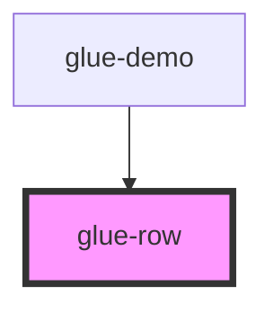

# glue-row

<!-- Auto Generated Below -->

## Properties

| Property  | Attribute | Description | Type                                                                | Default     |
| --------- | --------- | ----------- | ------------------------------------------------------------------- | ----------- |
| `align`   | `align`   |             | `"bottom" \| "center" \| "top"`                                     | `undefined` |
| `gutter`  | `gutter`  |             | `number \| string`                                                  | `0`         |
| `justify` | `justify` |             | `"center" \| "end" \| "space-around" \| "space-between" \| "start"` | `undefined` |

## Dependencies

### Used by

 - [glue-demo](../glue-demo)

### Graph

----------------------------------------------

*Built with [StencilJS](https://stenciljs.com/)*
