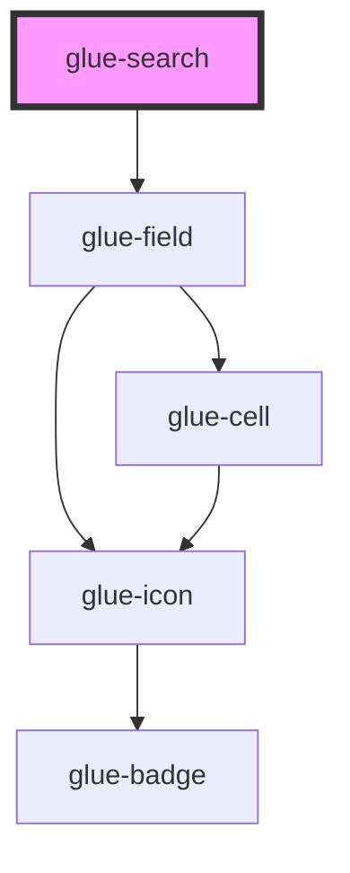

# glue-search

<!-- Auto Generated Below -->

## Properties

| Property       | Attribute       | Description | Type       | Default     |
| -------------- | --------------- | ----------- | ---------- | ----------- |
| `actionText`   | `action-text`   |             | `string`   | `undefined` |
| `background`   | `background`    |             | `string`   | `undefined` |
| `clearTrigger` | `clear-trigger` |             | `string`   | `undefined` |
| `clearable`    | `clearable`     |             | `boolean`  | `true`      |
| `label`        | `label`         |             | `string`   | `undefined` |
| `leftIcon`     | `left-icon`     |             | `string`   | `'search'`  |
| `modelValue`   | `model-value`   |             | `string`   | `undefined` |
| `rightIcon`    | `right-icon`    |             | `string`   | `undefined` |
| `shape`        | `shape`         |             | `"square"` | `undefined` |
| `showAction`   | `show-action`   |             | `boolean`  | `undefined` |

## Events

| Event         | Description | Type               |
| ------------- | ----------- | ------------------ |
| `cancel`      |             | `CustomEvent<any>` |
| `changeValue` |             | `CustomEvent<any>` |
| `search`      |             | `CustomEvent<any>` |

## Dependencies

### Depends on

- [glue-field](../glue-field)

### Graph

----------------------------------------------

*Built with [StencilJS](https://stenciljs.com/)*
