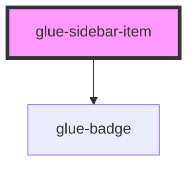

# glue-sidebar-item

<!-- Auto Generated Below -->

## Properties

| Property   | Attribute  | Description | Type      | Default     |
| ---------- | ---------- | ----------- | --------- | ----------- |
| `badge`    | `badge`    |             | `string`  | `undefined` |
| `disabled` | `disabled` |             | `boolean` | `undefined` |
| `dot`      | `dot`      |             | `boolean` | `undefined` |
| `title`    | `title`    |             | `string`  | `undefined` |

## Events

| Event   | Description | Type               |
| ------- | ----------- | ------------------ |
| `click` |             | `CustomEvent<any>` |

## Dependencies

### Depends on

- [glue-badge](../glue-badge)

### Graph

----------------------------------------------

*Built with [StencilJS](https://stenciljs.com/)*
