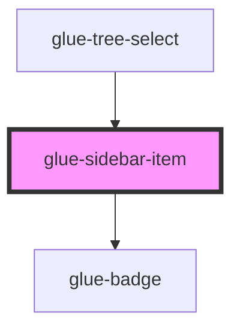

# glue-sidebar-item

<!-- Auto Generated Below -->

## Properties

| Property   | Attribute  | Description | Type               | Default     |
| ---------- | ---------- | ----------- | ------------------ | ----------- |
| `badge`    | `badge`    |             | `string`           | `undefined` |
| `disabled` | `disabled` |             | `boolean`          | `undefined` |
| `dot`      | `dot`      |             | `boolean`          | `undefined` |
| `g_title`  | `g_title`  |             | `string`           | `undefined` |
| `value`    | `value`    |             | `number \| string` | `undefined` |

## Events

| Event        | Description | Type               |
| ------------ | ----------- | ------------------ |
| `glueChange` |             | `CustomEvent<any>` |

## Methods

### `setActive() => Promise<void>`

#### Returns

Type: `Promise<void>`

### `setParentActive() => Promise<void>`

#### Returns

Type: `Promise<void>`

## Dependencies

### Used by

- [glue-tree-select](../glue-tree-select)

### Depends on

- [glue-badge](../glue-badge)

### Graph

---

_Built with [StencilJS](https://stenciljs.com/)_
