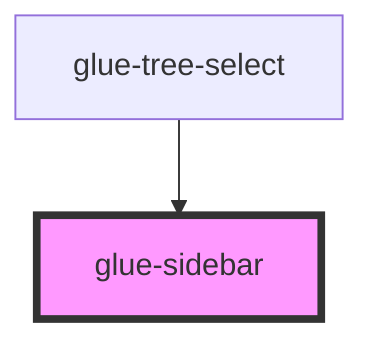

# glue-sidebar

<!-- Auto Generated Below -->

## Properties

| Property     | Attribute     | Description | Type  | Default     |
| ------------ | ------------- | ----------- | ----- | ----------- |
| `modelValue` | `model-value` |             | `any` | `undefined` |

## Events

| Event        | Description | Type               |
| ------------ | ----------- | ------------------ |
| `glueChange` |             | `CustomEvent<any>` |

## Methods

### `getActive() => Promise<any>`

#### Returns

Type: `Promise<any>`

### `setActive(value: any) => Promise<void>`

#### Returns

Type: `Promise<void>`

## Dependencies

### Used by

 - [glue-tree-select](../glue-tree-select)

### Graph

----------------------------------------------

*Built with [StencilJS](https://stenciljs.com/)*
