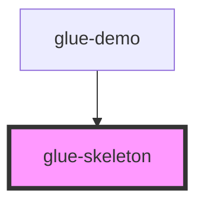

# glue-skeleton

<!-- Auto Generated Below -->

## Properties

| Property       | Attribute       | Description | Type               | Default             |
| -------------- | --------------- | ----------- | ------------------ | ------------------- |
| `animateState` | `animate-state` |             | `boolean`          | `true`              |
| `avatar`       | `avatar`        |             | `string`           | `undefined`         |
| `avatarShape`  | `avatar-shape`  |             | `string`           | `'round'`           |
| `avatarSize`   | `avatar-size`   |             | `string`           | `undefined`         |
| `loading`      | `loading`       |             | `boolean`          | `true`              |
| `round`        | `round`         |             | `boolean`          | `undefined`         |
| `row`          | `row`           |             | `number \| string` | `0`                 |
| `rowWidth`     | `row-width`     |             | `string`           | `DEFAULT_ROW_WIDTH` |
| `titleState`   | `title-state`   |             | `boolean`          | `undefined`         |
| `titleWidth`   | `title-width`   |             | `string`           | `undefined`         |

## Dependencies

### Used by

 - [glue-demo](../glue-demo)

### Graph

----------------------------------------------

*Built with [StencilJS](https://stenciljs.com/)*
