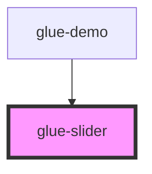

# glue-slider

<!-- Auto Generated Below -->

## Properties

| Property        | Attribute        | Description | Type               | Default     |
| --------------- | ---------------- | ----------- | ------------------ | ----------- |
| `activeColor`   | `active-color`   |             | `string`           | `undefined` |
| `barHeight`     | `bar-height`     |             | `number \| string` | `undefined` |
| `buttonBlock`   | `button-block`   |             | `string`           | `undefined` |
| `buttonSize`    | `button-size`    |             | `number \| string` | `undefined` |
| `disabled`      | `disabled`       |             | `boolean`          | `undefined` |
| `first`         | `first`          |             | `string`           | `undefined` |
| `inactiveColor` | `inactive-color` |             | `string`           | `undefined` |
| `max`           | `max`            |             | `number \| string` | `100`       |
| `min`           | `min`            |             | `number \| string` | `0`         |
| `range`         | `range`          |             | `boolean`          | `undefined` |
| `readonly`      | `readonly`       |             | `boolean`          | `undefined` |
| `step`          | `step`           |             | `number \| string` | `1`         |
| `value`         | `value`          |             | `any`              | `0`         |
| `vertical`      | `vertical`       |             | `boolean`          | `undefined` |

## Events

| Event           | Description | Type               |
| --------------- | ----------- | ------------------ |
| `glueChange`    |             | `CustomEvent<any>` |
| `glueDragEnd`   |             | `CustomEvent<any>` |
| `glueDragStart` |             | `CustomEvent<any>` |

## Dependencies

### Used by

 - [glue-demo](../glue-demo)

### Graph

----------------------------------------------

*Built with [StencilJS](https://stenciljs.com/)*
