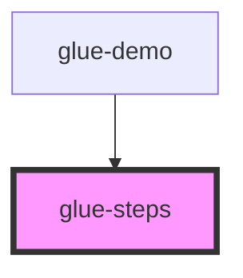

# glue-steps

<!-- Auto Generated Below -->

## Properties

| Property        | Attribute        | Description | Type               | Default        |
| --------------- | ---------------- | ----------- | ------------------ | -------------- |
| `active`        | `active`         |             | `number \| string` | `0`            |
| `activeColor`   | `active-color`   |             | `string`           | `undefined`    |
| `activeIcon`    | `active-icon`    |             | `string`           | `'checked'`    |
| `direction`     | `direction`      |             | `string`           | `'horizontal'` |
| `finishIcon`    | `finish-icon`    |             | `string`           | `undefined`    |
| `inactiveColor` | `inactive-color` |             | `string`           | `undefined`    |
| `inactiveIcon`  | `inactive-icon`  |             | `string`           | `undefined`    |

## Events

| Event       | Description | Type               |
| ----------- | ----------- | ------------------ |
| `clickStep` |             | `CustomEvent<any>` |

## Dependencies

### Used by

 - [glue-demo](../glue-demo)

### Graph

----------------------------------------------

*Built with [StencilJS](https://stenciljs.com/)*
