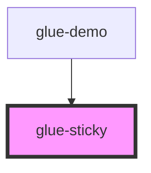

# glue-sticky

<!-- Auto Generated Below -->

## Properties

| Property            | Attribute             | Description | Type      | Default     |
| ------------------- | --------------------- | ----------- | --------- | ----------- |
| `container`         | `container`           |             | `any`     | `null`      |
| `fixed`             | `fixed`               |             | `boolean` | `false`     |
| `height`            | `height`              |             | `number`  | `0`         |
| `offsetBottomValue` | `offset-bottom-value` |             | `number`  | `0`         |
| `offsetTopValue`    | `offset-top-value`    |             | `number`  | `0`         |
| `position`          | `position`            |             | `string`  | `'top'`     |
| `transform`         | `transform`           |             | `number`  | `0`         |
| `width`             | `width`               |             | `number`  | `0`         |
| `zIndex`            | `z-index`             |             | `string`  | `undefined` |

## Dependencies

### Used by

 - [glue-demo](../glue-demo)

### Graph

----------------------------------------------

*Built with [StencilJS](https://stenciljs.com/)*
