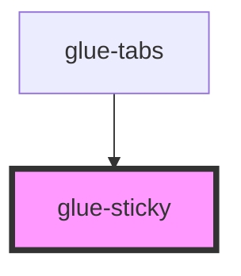

# glue-sticky

<!-- Auto Generated Below -->

## Properties

| Property            | Attribute             | Description | Type     | Default     |
| ------------------- | --------------------- | ----------- | -------- | ----------- |
| `container`         | `container`           |             | `any`    | `null`      |
| `offsetBottomValue` | `offset-bottom-value` |             | `number` | `0`         |
| `offsetTopValue`    | `offset-top-value`    |             | `number` | `0`         |
| `position`          | `position`            |             | `string` | `'top'`     |
| `zIndex`            | `z-index`             |             | `string` | `undefined` |

## Events

| Event        | Description | Type               |
| ------------ | ----------- | ------------------ |
| `glueScroll` |             | `CustomEvent<any>` |

## Dependencies

### Used by

 - [glue-tabs](../glue-tabs)

### Graph

----------------------------------------------

*Built with [StencilJS](https://stenciljs.com/)*
