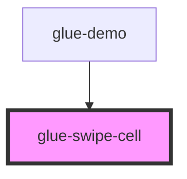

# glue-swipe-cell

<!-- Auto Generated Below -->

## Properties

| Property          | Attribute          | Description | Type      | Default     |
| ----------------- | ------------------ | ----------- | --------- | ----------- |
| `beforeClose`     | `before-close`     |             | `any`     | `undefined` |
| `disabled`        | `disabled`         |             | `boolean` | `false`     |
| `left`            | `left`             |             | `string`  | `''`        |
| `leftWidth`       | `left-width`       |             | `number`  | `undefined` |
| `name`            | `name`             |             | `string`  | `''`        |
| `right`           | `right`            |             | `string`  | `''`        |
| `rightWidth`      | `right-width`      |             | `number`  | `undefined` |
| `stopPropagation` | `stop-propagation` |             | `boolean` | `undefined` |

## Events

| Event             | Description | Type               |
| ----------------- | ----------- | ------------------ |
| `click`           |             | `CustomEvent<any>` |
| `glueCloseChange` |             | `CustomEvent<any>` |
| `glueOpenChange`  |             | `CustomEvent<any>` |

## Dependencies

### Used by

 - [glue-demo](../glue-demo)

### Graph

----------------------------------------------

*Built with [StencilJS](https://stenciljs.com/)*
