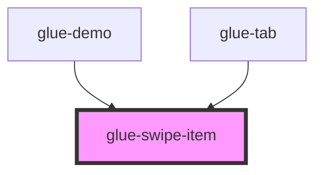

# glue-swipe-item

<!-- Auto Generated Below -->

## Properties

| Property | Attribute | Description | Type     | Default     |
| -------- | --------- | ----------- | -------- | ----------- |
| `first`  | `first`   |             | `string` | `undefined` |

## Methods

### `setOffset(offset: any) => Promise<void>`

#### Returns

Type: `Promise<void>`

## Dependencies

### Used by

 - [glue-demo](../glue-demo)
 - [glue-tab](../glue-tab)

### Graph

----------------------------------------------

*Built with [StencilJS](https://stenciljs.com/)*
