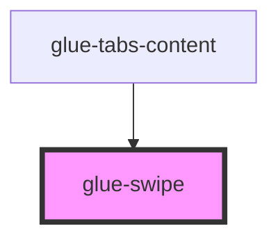

# glue-swipe

<!-- Auto Generated Below -->

## Properties

| Property          | Attribute          | Description | Type               | Default     |
| ----------------- | ------------------ | ----------- | ------------------ | ----------- |
| `autoplay`        | `autoplay`         |             | `number`           | `undefined` |
| `duration`        | `duration`         |             | `number \| string` | `500`       |
| `height`          | `height`           |             | `number`           | `undefined` |
| `indicatorColor`  | `indicator-color`  |             | `string`           | `undefined` |
| `initialSwipe`    | `initial-swipe`    |             | `number`           | `0`         |
| `lazyRender`      | `lazy-render`      |             | `boolean`          | `undefined` |
| `loop`            | `loop`             |             | `boolean`          | `false`     |
| `showIndicators`  | `show-indicators`  |             | `boolean`          | `false`     |
| `stopPropagation` | `stop-propagation` |             | `boolean`          | `false`     |
| `touchable`       | `touchable`        |             | `boolean`          | `false`     |
| `vertical`        | `vertical`         |             | `boolean`          | `undefined` |
| `width`           | `width`            |             | `number`           | `undefined` |

## Dependencies

### Used by

 - [glue-tabs-content](../glue-tabs-content)

### Graph

----------------------------------------------

*Built with [StencilJS](https://stenciljs.com/)*
