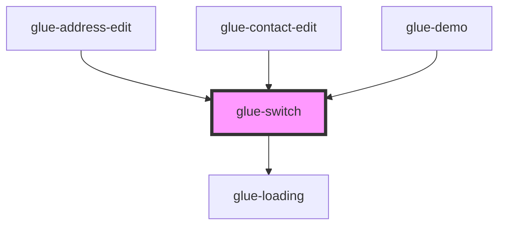

# glue-switch

<!-- Auto Generated Below -->

## Properties

| Property        | Attribute        | Description | Type               | Default     |
| --------------- | ---------------- | ----------- | ------------------ | ----------- |
| `activeColor`   | `active-color`   |             | `string`           | `undefined` |
| `activeValue`   | `active-value`   |             | `boolean`          | `true`      |
| `disabled`      | `disabled`       |             | `boolean`          | `undefined` |
| `inactiveColor` | `inactive-color` |             | `string`           | `undefined` |
| `inactiveValue` | `inactive-value` |             | `boolean`          | `false`     |
| `loading`       | `loading`        |             | `boolean`          | `undefined` |
| `modelValue`    | `model-value`    |             | `boolean`          | `undefined` |
| `size`          | `size`           |             | `number \| string` | `undefined` |

## Events

| Event         | Description | Type               |
| ------------- | ----------- | ------------------ |
| `change`      |             | `CustomEvent<any>` |
| `changeValue` |             | `CustomEvent<any>` |

## Dependencies

### Used by

 - [glue-address-edit](../glue-address-edit)
 - [glue-contact-edit](../glue-contact-edit)
 - [glue-demo](../glue-demo)

### Depends on

- [glue-loading](../glue-loading)

### Graph

----------------------------------------------

*Built with [StencilJS](https://stenciljs.com/)*
