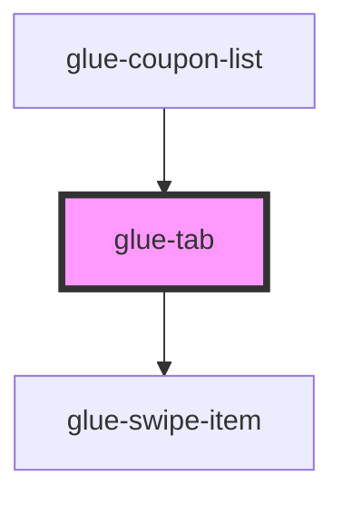

# glue-tab

<!-- Auto Generated Below -->

## Properties

| Property     | Attribute  | Description | Type               | Default     |
| ------------ | ---------- | ----------- | ------------------ | ----------- |
| `badge`      | `badge`    |             | `number \| string` | `undefined` |
| `disabled`   | `disabled` |             | `boolean`          | `undefined` |
| `dot`        | `dot`      |             | `boolean`          | `undefined` |
| `name`       | `name`     |             | `number \| string` | `undefined` |
| `title`      | `title`    |             | `string`           | `undefined` |
| `titleClass` | --         |             | `null`             | `undefined` |
| `titleStyle` | --         |             | `null`             | `undefined` |

## Dependencies

### Used by

- [glue-coupon-list](../glue-coupon-list)

### Depends on

- [glue-swipe-item](../glue-swipe-item)

### Graph

---

_Built with [StencilJS](https://stenciljs.com/)_
