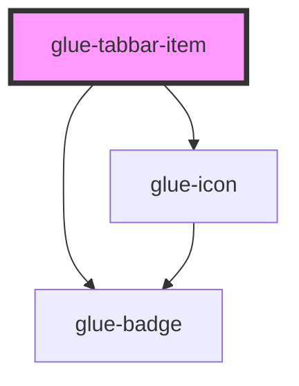

# glue-tabbar-item

<!-- Auto Generated Below -->

## Properties

| Property     | Attribute     | Description | Type      | Default     |
| ------------ | ------------- | ----------- | --------- | ----------- |
| `badge`      | `badge`       |             | `string`  | `undefined` |
| `dot`        | `dot`         |             | `boolean` | `undefined` |
| `icon`       | `icon`        |             | `string`  | `undefined` |
| `iconPrefix` | `icon-prefix` |             | `string`  | `undefined` |
| `name`       | `name`        |             | `string`  | `undefined` |
| `title`      | `title`       |             | `string`  | `undefined` |

## Events

| Event       | Description | Type               |
| ----------- | ----------- | ------------------ |
| `glueClick` |             | `CustomEvent<any>` |

## Methods

### `setActive(parentModelValue: any) => Promise<void>`

#### Returns

Type: `Promise<void>`

### `setParentActive() => Promise<void>`

#### Returns

Type: `Promise<void>`

## Dependencies

### Depends on

- [glue-icon](../glue-icon)
- [glue-badge](../glue-badge)

### Graph

----------------------------------------------

*Built with [StencilJS](https://stenciljs.com/)*
