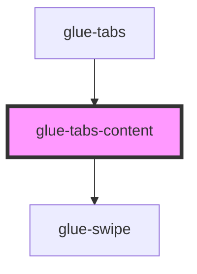

# glue-tabs-content

<!-- Auto Generated Below -->

## Properties

| Property       | Attribute       | Description | Type      | Default     |
| -------------- | --------------- | ----------- | --------- | ----------- |
| `animated`     | `animated`      |             | `boolean` | `undefined` |
| `count`        | `count`         |             | `boolean` | `false`     |
| `currentIndex` | `current-index` |             | `boolean` | `false`     |
| `duration`     | `duration`      |             | `boolean` | `false`     |
| `first`        | `first`         |             | `string`  | `undefined` |
| `inited`       | `inited`        |             | `boolean` | `undefined` |
| `lazyRender`   | `lazy-render`   |             | `boolean` | `undefined` |
| `swipeable`    | `swipeable`     |             | `boolean` | `undefined` |

## Dependencies

### Used by

 - [glue-tabs](../glue-tabs)

### Depends on

- [glue-swipe](../glue-swipe)

### Graph

----------------------------------------------

*Built with [StencilJS](https://stenciljs.com/)*
