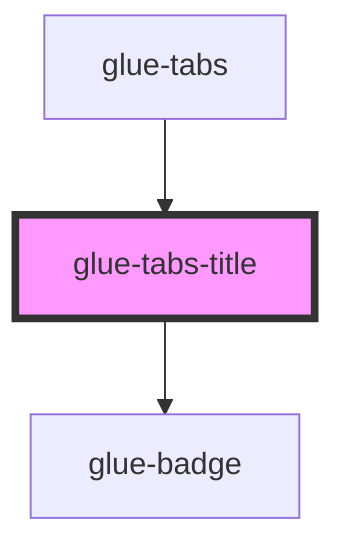

# glue-tabs-title

<!-- Auto Generated Below -->

## Properties

| Property        | Attribute        | Description | Type               | Default     |
| --------------- | ---------------- | ----------- | ------------------ | ----------- |
| `activeColor`   | `active-color`   |             | `string`           | `undefined` |
| `badge`         | `badge`          |             | `number \| string` | `undefined` |
| `color`         | `color`          |             | `string`           | `undefined` |
| `disabled`      | `disabled`       |             | `boolean`          | `undefined` |
| `dot`           | `dot`            |             | `boolean`          | `undefined` |
| `inactiveColor` | `inactive-color` |             | `string`           | `undefined` |
| `isActive`      | `is-active`      |             | `boolean`          | `undefined` |
| `renderTitle`   | `render-title`   |             | `any`              | `undefined` |
| `scrollable`    | `scrollable`     |             | `boolean`          | `undefined` |
| `title`         | `title`          |             | `string`           | `undefined` |
| `type`          | `type`           |             | `string`           | `undefined` |

## Dependencies

### Used by

 - [glue-tabs](../glue-tabs)

### Depends on

- [glue-badge](../glue-badge)

### Graph

----------------------------------------------

*Built with [StencilJS](https://stenciljs.com/)*
