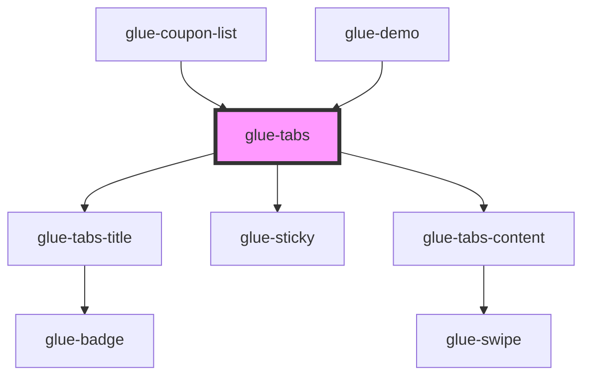

# glue-tabs

<!-- Auto Generated Below -->

## Properties

| Property             | Attribute              | Description | Type               | Default     |
| -------------------- | ---------------------- | ----------- | ------------------ | ----------- |
| `active`             | `active`               |             | `number`           | `0`         |
| `animated`           | `animated`             |             | `boolean`          | `undefined` |
| `background`         | `background`           |             | `string`           | `undefined` |
| `beforeChange`       | `before-change`        |             | `any`              | `undefined` |
| `border`             | `border`               |             | `boolean`          | `undefined` |
| `color`              | `color`                |             | `string`           | `undefined` |
| `duration`           | `duration`             |             | `number`           | `0.3`       |
| `ellipsis`           | `ellipsis`             |             | `boolean`          | `true`      |
| `lazyRender`         | `lazy-render`          |             | `boolean`          | `true`      |
| `lineHeight`         | `line-height`          |             | `number \| string` | `undefined` |
| `lineWidth`          | `line-width`           |             | `number \| string` | `undefined` |
| `offsetTopVlaue`     | `offset-top-vlaue`     |             | `number`           | `0`         |
| `scrollspy`          | `scrollspy`            |             | `boolean`          | `undefined` |
| `sticky`             | `sticky`               |             | `boolean`          | `undefined` |
| `swipeThreshold`     | `swipe-threshold`      |             | `number`           | `5`         |
| `swipeable`          | `swipeable`            |             | `boolean`          | `undefined` |
| `titleActiveColor`   | `title-active-color`   |             | `string`           | `undefined` |
| `titleInactiveColor` | `title-inactive-color` |             | `string`           | `undefined` |
| `type`               | `type`                 |             | `string`           | `'line'`    |

## Dependencies

### Used by

 - [glue-coupon-list](../glue-coupon-list)
 - [glue-demo](../glue-demo)

### Depends on

- [glue-tabs-title](../glue-tabs-title)
- [glue-sticky](../glue-sticky)
- [glue-tabs-content](../glue-tabs-content)

### Graph

----------------------------------------------

*Built with [StencilJS](https://stenciljs.com/)*
