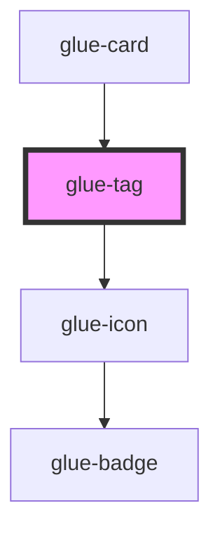

# glue-tag

<!-- Auto Generated Below -->

## Properties

| Property    | Attribute    | Description | Type      | Default     |
| ----------- | ------------ | ----------- | --------- | ----------- |
| `closeable` | `closeable`  |             | `boolean` | `undefined` |
| `color`     | `color`      |             | `string`  | `undefined` |
| `first`     | `first`      |             | `string`  | `undefined` |
| `mark`      | `mark`       |             | `boolean` | `undefined` |
| `plain`     | `plain`      |             | `boolean` | `undefined` |
| `round`     | `round`      |             | `boolean` | `undefined` |
| `show`      | `show`       |             | `boolean` | `true`      |
| `size`      | `size`       |             | `string`  | `undefined` |
| `textColor` | `text-color` |             | `string`  | `undefined` |
| `type`      | `type`       |             | `string`  | `'default'` |

## Events

| Event   | Description | Type               |
| ------- | ----------- | ------------------ |
| `close` |             | `CustomEvent<any>` |

## Dependencies

### Used by

 - [glue-card](../glue-card)

### Depends on

- [glue-icon](../glue-icon)

### Graph

----------------------------------------------

*Built with [StencilJS](https://stenciljs.com/)*
