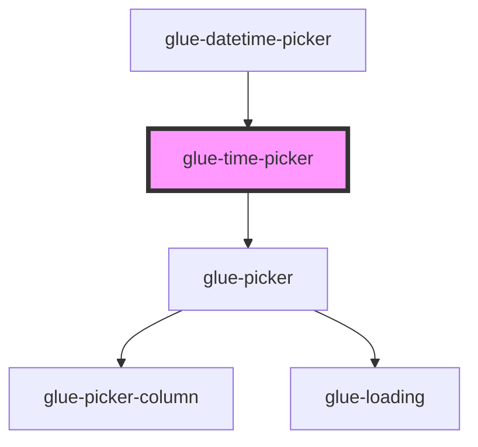

# glue-time-picker

<!-- Auto Generated Below -->

## Properties

| Property            | Attribute             | Description | Type      | Default     |
| ------------------- | --------------------- | ----------- | --------- | ----------- |
| `allowHtml`         | `allow-html`          |             | `boolean` | `undefined` |
| `cancelButtonText`  | `cancel-button-text`  |             | `string`  | `undefined` |
| `columnsOrder`      | --                    |             | `[]`      | `undefined` |
| `confirmButtonText` | `confirm-button-text` |             | `string`  | `undefined` |
| `filter`            | `filter`              |             | `any`     | `undefined` |
| `formatter`         | `formatter`           |             | `any`     | `undefined` |
| `itemHeight`        | `item-height`         |             | `number`  | `44`        |
| `loading`           | `loading`             |             | `boolean` | `undefined` |
| `maxHour`           | `max-hour`            |             | `number`  | `23`        |
| `maxMinute`         | `max-minute`          |             | `number`  | `59`        |
| `minHour`           | `min-hour`            |             | `number`  | `0`         |
| `minMinute`         | `min-minute`          |             | `number`  | `0`         |
| `modelValue`        | `model-value`         |             | `any`     | `null`      |
| `readonly`          | `readonly`            |             | `boolean` | `undefined` |
| `showToolbar`       | `show-toolbar`        |             | `boolean` | `false`     |
| `swipeDuration`     | `swipe-duration`      |             | `number`  | `1000`      |
| `title`             | `title`               |             | `string`  | `undefined` |
| `visibleItemCount`  | `visible-item-count`  |             | `number`  | `6`         |

## Dependencies

### Used by

 - [glue-datetime-picker](../glue-datetime-picker)

### Depends on

- [glue-picker](../glue-picker)

### Graph

----------------------------------------------

*Built with [StencilJS](https://stenciljs.com/)*
