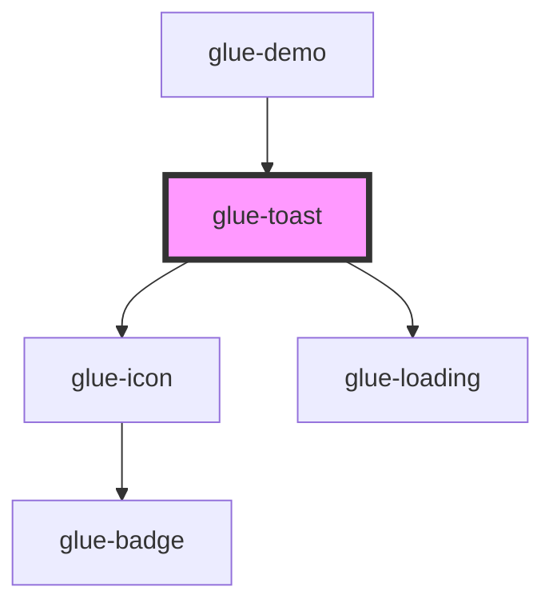

# glue-toast

<!-- Auto Generated Below -->

## Properties

| Property              | Attribute                | Description | Type                                                   | Default     |
| --------------------- | ------------------------ | ----------- | ------------------------------------------------------ | ----------- |
| `closeOnClick`        | `close-on-click`         |             | `boolean`                                              | `undefined` |
| `closeOnClickOverlay` | `close-on-click-overlay` |             | `boolean`                                              | `undefined` |
| `duration`            | `duration`               |             | `number`                                               | `5000`      |
| `easing`              | `easing`                 |             | `string`                                               | `EASING`    |
| `forbidClick`         | `forbid-click`           |             | `boolean`                                              | `undefined` |
| `icon`                | `icon`                   |             | `string`                                               | `undefined` |
| `iconPrefix`          | `icon-prefix`            |             | `string`                                               | `undefined` |
| `loadingType`         | `loading-type`           |             | `"fail" \| "html" \| "loading" \| "success" \| "text"` | `undefined` |
| `lockScroll`          | `lock-scroll`            |             | `boolean`                                              | `undefined` |
| `message`             | `message`                |             | `string`                                               | `undefined` |
| `overlayClass`        | --                       |             | `null`                                                 | `undefined` |
| `overlayStyle`        | --                       |             | `object`                                               | `undefined` |
| `position`            | `position`               |             | `string`                                               | `'middle'`  |
| `show`                | `show`                   |             | `boolean`                                              | `undefined` |
| `type`                | `type`                   |             | `string`                                               | `'text'`    |

## Events

| Event        | Description | Type               |
| ------------ | ----------- | ------------------ |
| `glueClick`  |             | `CustomEvent<any>` |
| `glueClose`  |             | `CustomEvent<any>` |
| `glueClosed` |             | `CustomEvent<any>` |
| `glueOpen`   |             | `CustomEvent<any>` |
| `glueOpened` |             | `CustomEvent<any>` |
| `toggle`     |             | `CustomEvent<any>` |

## Dependencies

### Used by

 - [glue-demo](../glue-demo)

### Depends on

- [glue-icon](../glue-icon)
- [glue-loading](../glue-loading)

### Graph

----------------------------------------------

*Built with [StencilJS](https://stenciljs.com/)*
