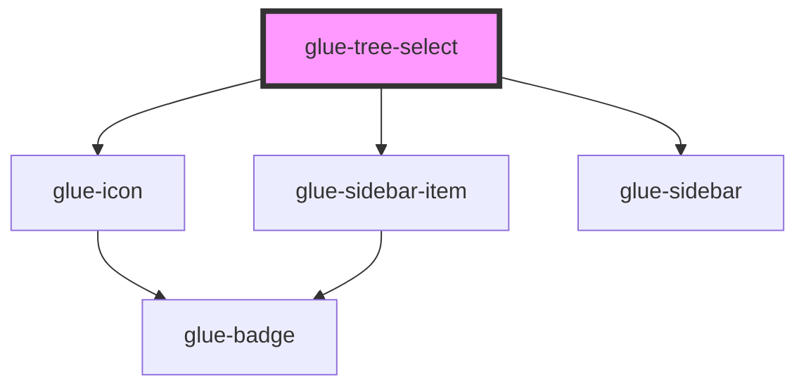

# glue-tree-select

<!-- Auto Generated Below -->

## Properties

| Property          | Attribute           | Description | Type     | Default     |
| ----------------- | ------------------- | ----------- | -------- | ----------- |
| `activeId`        | `active-id`         |             | `any`    | `undefined` |
| `first`           | `first`             |             | `string` | `undefined` |
| `height`          | `height`            |             | `number` | `300300`    |
| `items`           | `items`             |             | `any`    | `[]`        |
| `mainActiveIndex` | `main-active-index` |             | `any`    | `undefined` |
| `max`             | `max`               |             | `number` | `Infinity`  |
| `selectedIcon`    | `selected-icon`     |             | `string` | `'success'` |

## Events

| Event           | Description | Type               |
| --------------- | ----------- | ------------------ |
| `glueClickItem` |             | `CustomEvent<any>` |
| `glueClickNav`  |             | `CustomEvent<any>` |

## Dependencies

### Depends on

- [glue-icon](../glue-icon)
- [glue-sidebar-item](../glue-sidebar-item)
- [glue-sidebar](../glue-sidebar)

### Graph

----------------------------------------------

*Built with [StencilJS](https://stenciljs.com/)*
