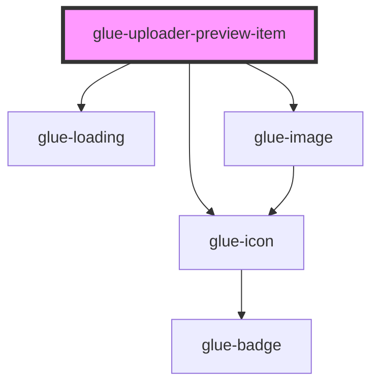

# glue-preview-item

<!-- Auto Generated Below -->

## Properties

| Property       | Attribute       | Description | Type                                                       | Default     |
| -------------- | --------------- | ----------- | ---------------------------------------------------------- | ----------- |
| `beforeDelete` | `before-delete` |             | `any`                                                      | `undefined` |
| `deletable`    | `deletable`     |             | `boolean`                                                  | `undefined` |
| `imageFit`     | `image-fit`     |             | `"contain" \| "cover" \| "fill" \| "none" \| "scale-down"` | `undefined` |
| `index`        | `index`         |             | `number`                                                   | `undefined` |
| `item`         | `item`          |             | `any`                                                      | `undefined` |
| `lazyLoad`     | `lazy-load`     |             | `boolean`                                                  | `undefined` |
| `name`         | `name`          |             | `string`                                                   | `undefined` |
| `previewSize`  | `preview-size`  |             | `number \| string`                                         | `undefined` |

## Dependencies

### Depends on

- [glue-icon](../glue-icon)
- [glue-loading](../glue-loading)
- [glue-image](../glue-image)

### Graph

----------------------------------------------

*Built with [StencilJS](https://stenciljs.com/)*
