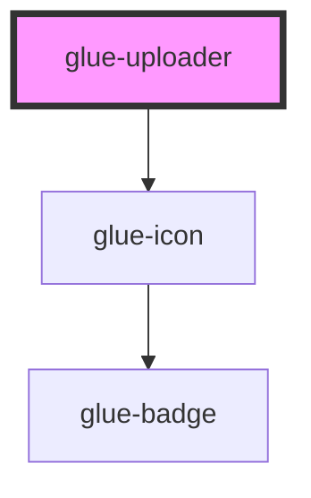

# glue-uploader

<!-- Auto Generated Below -->

## Properties

| Property           | Attribute            | Description | Type                            | Default            |
| ------------------ | -------------------- | ----------- | ------------------------------- | ------------------ |
| `accept`           | `accept`             |             | `string`                        | `'image/*'`        |
| `afterRead`        | `after-read`         |             | `any`                           | `undefined`        |
| `beforeDelete`     | `before-delete`      |             | `any`                           | `undefined`        |
| `beforeRead`       | `before-read`        |             | `any`                           | `undefined`        |
| `capture`          | `capture`            |             | `string`                        | `undefined`        |
| `deletable`        | `deletable`          |             | `boolean`                       | `true`             |
| `disabled`         | `disabled`           |             | `boolean`                       | `undefined`        |
| `imageFit`         | `image-fit`          |             | `string`                        | `'cover'`          |
| `lazyLoad`         | `lazy-load`          |             | `boolean`                       | `undefined`        |
| `maxCount`         | `max-count`          |             | `number`                        | `Number.MAX_VALUE` |
| `maxSize`          | `max-size`           |             | `number`                        | `Number.MAX_VALUE` |
| `modelValue`       | --                   |             | `[]`                            | `undefined`        |
| `multiple`         | `multiple`           |             | `boolean`                       | `undefined`        |
| `name`             | `name`               |             | `string`                        | `''`               |
| `previewFullImage` | `preview-full-image` |             | `boolean`                       | `true`             |
| `previewImage`     | `preview-image`      |             | `boolean`                       | `true`             |
| `previewOptions`   | --                   |             | `object`                        | `undefined`        |
| `previewSize`      | `preview-size`       |             | `number \| string`              | `undefined`        |
| `resultType`       | `result-type`        |             | `"dataUrl" \| "file" \| "text"` | `'dataUrl'`        |
| `showUpload`       | `show-upload`        |             | `boolean`                       | `true`             |
| `uploadIcon`       | `upload-icon`        |             | `string`                        | `'photograph'`     |
| `uploadText`       | `upload-text`        |             | `string`                        | `undefined`        |

## Dependencies

### Depends on

- [glue-icon](../glue-icon)

### Graph

----------------------------------------------

*Built with [StencilJS](https://stenciljs.com/)*
